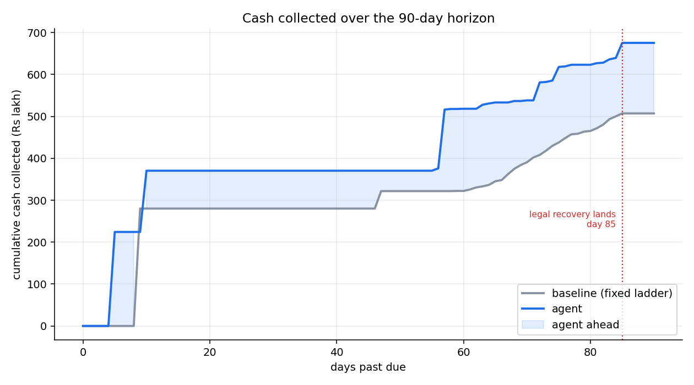
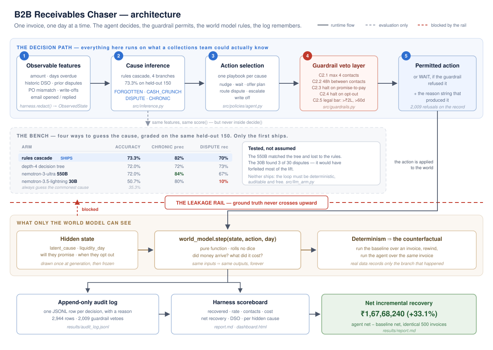
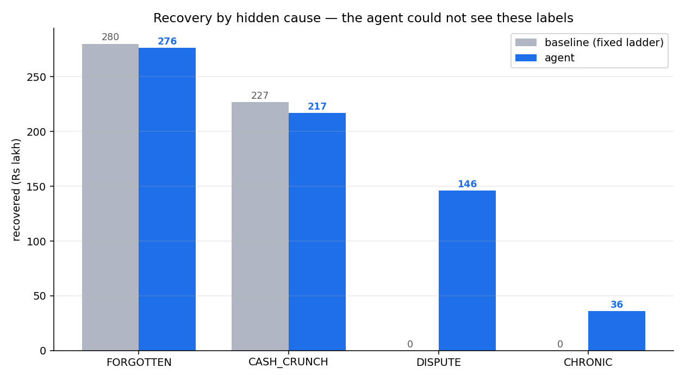

# B2B Receivables Chaser

**Razorpay AI Buildathon 2026 · Track 3: AI Revenue Recovery**

Businesses chase overdue invoices on a fixed ladder — reminder day 7, firmer reminder day 21, phone call day 45 — giving every customer the same treatment. That is wrong, because invoices go unpaid for completely different reasons, and each reason needs a different response. This agent works out **why** each invoice is unpaid, does the one thing that works for that reason, stops when it should stop, and logs every decision.

## The result

> ### Net incremental recovery: **₹1,67,68,240 (+33.1%)**
>
> | | baseline (fixed ladder) | agent |
> |---|---:|---:|
> | Net recovery | ₹5,06,36,900 | **₹6,74,05,140** |
> | Recovery rate | 60.0% | **77.2%** |
> | Contacts sent | 1,129 | **350** |
>
> Identical 500 invoices, identical world, identical 90 days. The agent recovered **₹1.68 crore more while sending 779 fewer messages.**



**One number that does *not* flatter this agent, stated up front: mean days-to-cash gets worse, 33.9 → 35.1 days.** That is real, it is explained in [Where it fails](#where-it-fails), and a team optimising for DSO rather than for cash would be right to reject this agent. Full analysis in **[results/report.md](results/report.md)**.

## Run it

```bash
pip install -r requirements.txt
```
```bash
python run.py --generate        # 500 invoices with hidden causes, SEED=42
```
```bash
python run.py --verify          # 34 checks, including determinism
```
```bash
python run.py --policy baseline # the fixed ladder — the number to beat
```
```bash
python run.py --infer           # both cause-inference arms, confusion matrices
```
```bash
python run.py --policy agent    # the agent + guardrails + audit log
```
```bash
python run.py --compare         # writes results/report.md and both charts
```

Seven commands from a clean clone. Everything is seeded; two runs produce identical numbers.

## Architecture



The load-bearing idea is the **leakage rail**. The invoice carries a hidden `latent_cause`, but a policy never receives it: the harness hands policies an `ObservedState` built by `redact()`, holding only what a real collections team would know — what it sent, when, and what came back. Reading ground truth from a policy requires visibly going around a named function.

## Why simulate instead of using a real dataset

Real invoice data records what happened **once**, under someone else's chasing policy. It cannot tell you what *would* have happened if you had waited three more days, or called instead of emailed. Without that, a new decision policy cannot be scored at all.

The world model is a pure function that rolls no dice — every random draw a customer will ever need is made once at generation time and frozen onto the invoice. So the baseline can be run over an invoice, time rewound, and the agent run over the *same* invoice. The difference is attributable to the policy alone. That counterfactual is not a shortcut around missing data; it is the only structure that makes the headline metric computable.

## The four hidden causes

The agent cannot see these. It must infer them from clues that correlate with the cause but never determine it.

| Cause | Share | How it actually gets paid |
|---|---|---|
| `FORGOTTEN` | 35% | Pays 2 days after the **first** contact of any kind. Extra contacts do nothing. |
| `CASH_CRUNCH` | 25% | Has a hidden liquidity day (40–70). Contacts before it achieve nothing. |
| `DISPUTE` | 20% | Never pays from reminders. Pays 10 days after `ROUTE_DISPUTE`. Each reminder sent before routing adds 3 days. |
| `CHRONIC` | 20% | Never pays. Sole exception: legal notice above ₹2,00,000 recovers 40% on day 85. |

Costs make restraint measurable: `NUDGE` ₹20, `CALL`/`OFFER_PLAN` ₹200, `ROUTE_DISPUTE` ₹500, `ESCALATE_LEGAL` ₹2,000, `WAIT` and `WRITE_OFF` free. Without costs the optimal strategy is to spam every action at every invoice.

## Stopping rules

Enforced by a wrapper that can veto **any** action regardless of what the policy wants. A guardrail you can forget to call is not a guardrail.

1. Maximum **4 contacts** per invoice, ever.
2. Minimum **48 hours** between any two contacts.
3. **Auto-halt on promise-to-pay** until the promised date passes.
4. **Auto-halt permanently on customer opt-out.**
5. `ESCALATE_LEGAL` requires amount **> ₹2,00,000 AND** days overdue **> 60**.
6. `WRITE_OFF` and `PAID` are **terminal** — no action after either.
7. Horizon is **90 days**; anything unresolved becomes a write-off.

Rules 1–5 live in [`src/guardrails.py`](src/guardrails.py). Rules 6–7 are physics, not policy — acting after `PAID` is a contradiction, not a compliance breach, so the world model raises instead of vetoing.

**The agent does not re-check rule 5 itself.** It states its intent from day 0 and the guardrail refuses until the invoice is eligible, producing **2,009 veto rows** in the audit log. An earlier version duplicated the rule inside the policy and the veto layer fired *zero* times — an untested guardrail, not a safe one.

## Cause inference

Two arms, both scored on the same stratified held-out 150 invoices.

**Rules arm — 73.3%** (ships)

| truth \ guess | FORG | CASH | DISP | CHRO | recall |
|---|---:|---:|---:|---:|---:|
| FORGOTTEN | 38 | 2 | 13 | 0 | 72% |
| CASH_CRUNCH | 1 | 24 | 8 | 4 | 65% |
| DISPUTE | 5 | 2 | 21 | 2 | 70% |
| CHRONIC | 0 | 1 | 2 | 27 | 90% |
| **precision** | 86% | 83% | 48% | **82%** | |

**Decision tree, depth 4 — 72.0%**

| truth \ guess | FORG | CASH | DISP | CHRO | recall |
|---|---:|---:|---:|---:|---:|
| FORGOTTEN | 35 | 2 | 16 | 0 | 66% |
| CASH_CRUNCH | 1 | 30 | 2 | 4 | 81% |
| DISPUTE | 4 | 0 | 22 | 4 | 73% |
| CHRONIC | 5 | 4 | 0 | 21 | 70% |
| **precision** | 78% | 83% | 55% | **72%** | |

Accuracy is deliberately **not** 100%: 18 of the 150 held-out invoices carry clues generated from the wrong cause and are unlearnable by construction, putting the ceiling near 88%.

### Why the rules arm ships, and it is not because it scored higher

The arms finish **2 invoices apart on n=150**, which is noise, not a result. The tie-break that matters is **precision on CHRONIC — 82% vs 72%** — because CHRONIC is the only guess this agent acts on *irreversibly*: it leads to `WRITE_OFF`, which is terminal. A false CHRONIC does not waste ₹20 on an email; it discards an invoice that would have paid in full. On this split that is 6 invoices wrongly written off under the rules arm against 8 under the tree.

A second reason: the rules arm is not trained on anything, so all 500 invoices are effectively held out when the agent runs. A tree-driven agent would be scored partly on its own training data.

<details>
<summary><b>The full decision tree</b> — the entire model, capped at depth 4 so a human can read it</summary>

```
|--- customer_pays_after_day_of_month <= 19.50
|   |--- customer_prior_disputes <= 0.50
|   |   |--- customer_historic_dso <= 75.00
|   |   |   |--- partial_delivery_flag <= 0.50
|   |   |   |   |--- class: FORGOTTEN
|   |   |   |--- partial_delivery_flag >  0.50
|   |   |   |   |--- class: DISPUTE
|   |   |--- customer_historic_dso >  75.00
|   |   |   |--- amount <= 61850.00
|   |   |   |   |--- class: CHRONIC
|   |   |   |--- amount >  61850.00
|   |   |   |   |--- class: CHRONIC
|   |--- customer_prior_disputes >  0.50
|   |   |--- email_replied <= 0.50
|   |   |   |--- customer_historic_dso <= 61.00
|   |   |   |   |--- class: DISPUTE
|   |   |   |--- customer_historic_dso >  61.00
|   |   |   |   |--- class: CHRONIC
|   |   |--- email_replied >  0.50
|   |   |   |--- customer_historic_dso <= 35.50
|   |   |   |   |--- class: FORGOTTEN
|   |   |   |--- customer_historic_dso >  35.50
|   |   |   |   |--- class: DISPUTE
|--- customer_pays_after_day_of_month >  19.50
|   |--- customer_historic_dso <= 81.00
|   |   |--- po_mismatch_flag <= 0.50
|   |   |   |--- customer_prior_writeoffs <= 1.50
|   |   |   |   |--- class: CASH_CRUNCH
|   |   |   |--- customer_prior_writeoffs >  1.50
|   |   |   |   |--- class: CHRONIC
|   |   |--- po_mismatch_flag >  0.50
|   |   |   |--- email_opened <= 0.50
|   |   |   |   |--- class: DISPUTE
|   |   |   |--- email_opened >  0.50
|   |   |   |   |--- class: CASH_CRUNCH
|   |--- customer_historic_dso >  81.00
|   |   |--- customer_prior_writeoffs <= 1.50
|   |   |   |--- customer_historic_dso <= 92.00
|   |   |   |   |--- class: CASH_CRUNCH
|   |   |   |--- customer_historic_dso >  92.00
|   |   |   |   |--- class: CHRONIC
|   |   |--- customer_prior_writeoffs >  1.50
|   |   |   |--- class: CHRONIC
```

Two things worth noticing, neither of them flattering. The tree roots on `customer_pays_after_day_of_month` because that feature is close to a giveaway — 90% of CASH_CRUNCH invoices sit at ≥ 20 against 5% of FORGOTTEN and 3% of DISPUTE — which is a weakness in how the clues were generated, not a discovery. And one branch splits on `amount` and returns `CHRONIC` on both sides, so depth 4 is not fully used.

</details>

## Where the lift comes from

Split by the hidden cause, and within each cause into the money side and the cost side. The four net figures reconcile to the headline exactly — an attribution that does not reconcile is a story, not an analysis.

| hidden cause | n | Δ recovered | Δ cost | **Δ net** | contacts |
|---|---:|---:|---:|---:|---:|
| DISPUTE | 100 | +₹1,46,11,400 | +₹22,900 | **+₹1,45,88,500** | 288 → 26 |
| CHRONIC | 100 | +₹35,86,080 | +₹32,300 | **+₹35,53,780** | 295 → 47 |
| FORGOTTEN | 175 | −₹3,67,500 | +₹13,140 | **−₹3,80,640** | 175 → 149 |
| CASH_CRUNCH | 125 | −₹10,00,100 | −₹6,700 | **−₹9,93,400** | 371 → 128 |
| **total** | 500 | +₹1,68,29,880 | +₹61,640 | **+₹1,67,68,240** | 1,129 → 350 |

**Two of the four are negative.** The entire lift comes from DISPUTE and CHRONIC. On FORGOTTEN and CASH_CRUNCH the agent is actively *worse* than a dumb ladder, because the baseline was already near-perfect there and every misclassification is pure downside.

### The value of correctly doing nothing

**63 of 100** CHRONIC invoices were never contacted once. The baseline spent **₹14,520** chasing those same invoices and recovered nothing from them. Contacts on CHRONIC fell 295 → 47, and 25 legal notices (₹50,000) recovered **₹35,86,080**.



## Where it fails

Five failures, each found by comparing what happened to the *same invoice* under both policies. Every invoice id is in `data/invoices.csv`. Full detail in [results/report.md](results/report.md).

**1 · 14 payable invoices written off on day 0 — ₹13,67,600 forfeited.** The agent wrongly inferred CHRONIC and issued `WRITE_OFF`, which is terminal. The baseline collected every one in full — `INV-0012` (CASH_CRUNCH, ₹1,82,300, collected day 47), `INV-0044` (FORGOTTEN, ₹1,23,800, collected day 9). *Root cause:* not a weak classifier, but a fallible guess paired with an irreversible action.

**2 · 51 of 126 dispute routings were wrong — ₹25,500 wasted.** DISPUTE precision is 48%, the weakest number in the system. Worse than the wasted ₹500 is the *silence* that follows: the DISPUTE playbook suppresses all reminders, so **23 FORGOTTEN invoices** were routed and then deliberately ignored, paying on day 75 instead of day 9. *Root cause:* `po_mismatch_flag` fires on 5% of FORGOTTEN invoices as a base rate, and FORGOTTEN is the largest class, so base-rate contamination swamps the branch.

**3 · 43 of 87 cash-crunch nudges fired before the money existed.** *Root cause:* no feature carries timing. `customer_pays_after_day_of_month` says the customer is cash-constrained but is drawn *independently* of `liquidity_day`, so it contains zero information about when money arrives. This is a missing-feature problem; no amount of model improvement fixes it.

**4 · 25 real disputes never routed — ₹59,37,100 unrecoverable.** The mirror of failure 2. `ROUTE_DISPUTE` is the only action in the entire menu that resolves a dispute, so an unrecognised one can never be paid. *Root cause:* precision and recall on DISPUTE trade directly against each other; no threshold fixes both.

**5 · Mean days-to-cash is worse than the baseline's — 33.9 → 35.1.** On FORGOTTEN specifically, 9.0 → 19.2. *Root cause:* nudging on day 3 works exactly as designed when the guess is right (day 9.0 → 5.0), but misrouted invoices drift to day 75, and a minority of large delays outweighs a majority of small gains. The agent also deliberately waits on CASH_CRUNCH, and collects CHRONIC money on day 85 that the baseline never collects at all — cash the baseline's DSO never has to average in.

### One fix I found and deliberately did not apply

`WRITE_OFF` on a small chronic invoice is **strictly dominated** by `WAIT` in this world model. Both cost ₹0, and both end as a write-off at the horizon for a genuinely chronic invoice — but `WAIT` keeps the upside on a *misclassified* one, since an uncontacted FORGOTTEN still pays on day 75. Switching would recover **₹13,67,600** and lift the recovery rate to 80.0%.

I kept `WRITE_OFF`, because it is what the spec I wrote says, and reporting the loss is worth more than quietly engineering it away. The reasoning is recorded at [`config.py`](config.py) so a later change cannot happen by accident.

## What I would build next with real Razorpay data

1. **Replace the simulator's payment rules with a survival model fitted to real settlement times**, keeping the counterfactual harness exactly as it is. The harness is the reusable asset here; the world model is the part that should be learned rather than assumed.
2. **Make the action irreversibility explicit in the decision rule.** Failures 1 and 4 are both the same bug: expected value is computed as if every action were reversible. `WRITE_OFF` should require a much higher confidence bar than `NUDGE_SOFT`, scaled by invoice value — a cost-sensitive threshold per action, not one classifier feeding all four playbooks.
3. **Find a feature that carries timing.** Failure 3 is unfixable by modelling. Payment-history seasonality, GST filing dates, or observed settlement patterns on the customer's *other* invoices would give the agent something real to aim at instead of the middle of a range it cannot see into.
4. **Run online with a holdout arm.** The counterfactual argument that makes this simulation legitimate is the same argument for keeping a permanent random-assignment control group in production — otherwise the lift stops being measurable the moment it ships.

## Repo layout

```
config.py                 every tunable number; no magic numbers elsewhere
run.py                    single entry point
src/simulator.py          generates 500 invoices, hidden causes, correlated clues
src/world_model.py        step(state, action, day) — pure, deterministic
src/harness.py            the scoreboard + the run-time leakage rail
src/inference.py          rules arm and depth-4 tree, both scored held-out
src/guardrails.py         the veto layer — can overrule any policy
src/policies/baseline.py  the fixed ladder
src/policies/agent.py     inference → playbook per cause
src/audit.py              append-only JSONL decision log
src/report.py             generates results/report.md and both charts
verify_phase1.py          34 checks, including a determinism proof
```

Stack: Python 3.11, pandas, numpy, scikit-learn, matplotlib. No LLM is used for any pay/wait/write-off decision — that logic is rule-based and auditable end to end.

## Verification

- `data/invoices.csv` — exactly 500 rows, cause mix 35/25/20/20
- `results/audit_log.jsonl` — 2,944 rows, one per decision, every one with a reason; 2,009 guardrail vetoes
- `python run.py --verify` — 34 checks including a byte-identical determinism proof across two runs
- Every number in `results/report.md` is computed from the runs by `src/report.py`. None is typed in.
